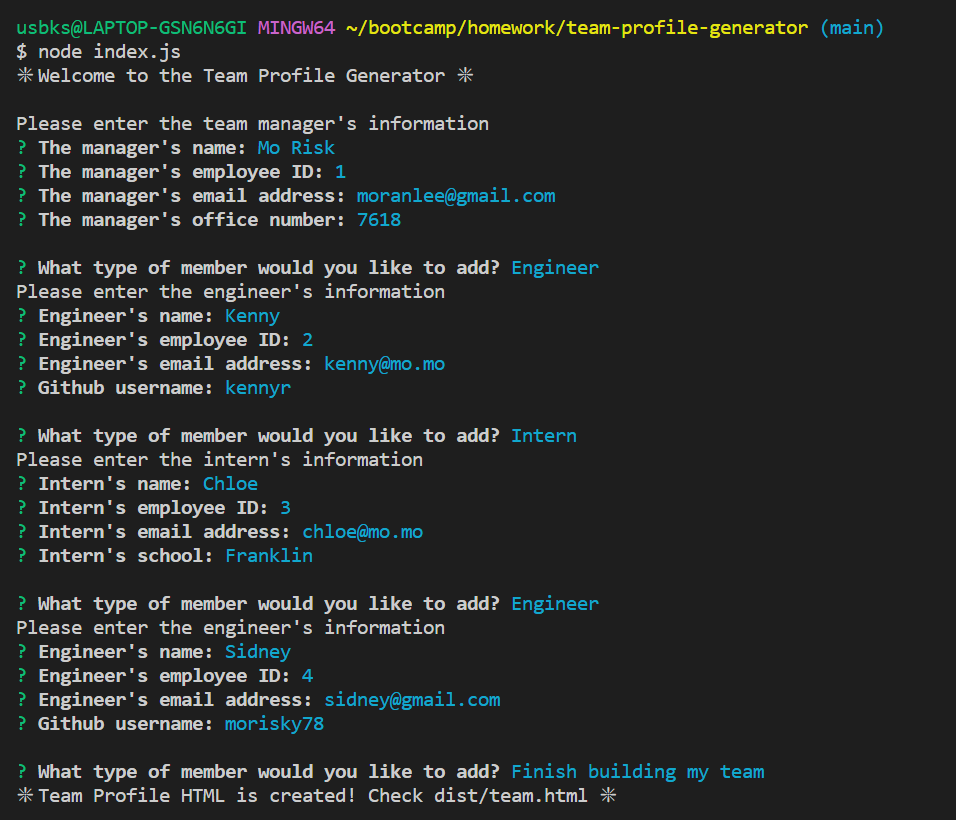
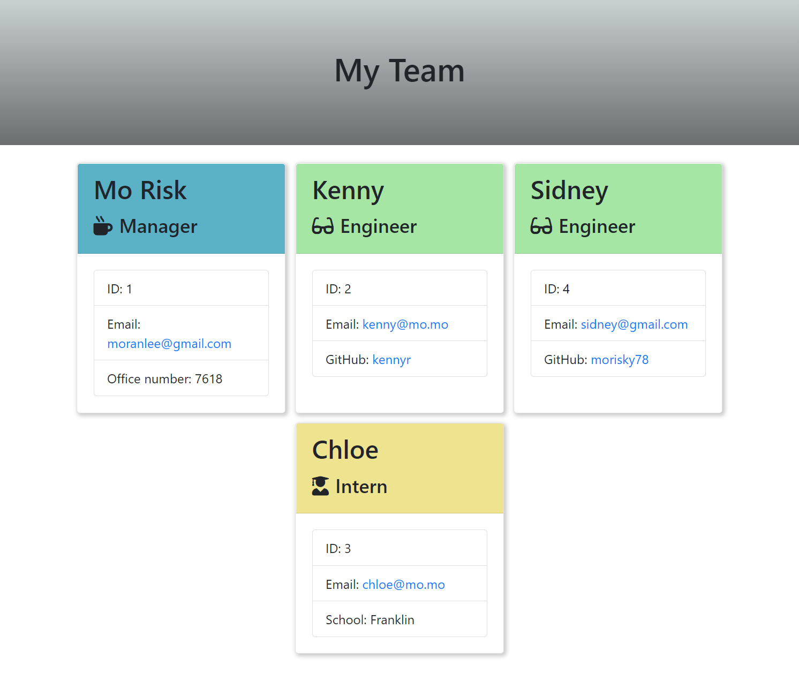

# team-profile-generator

## Description
This is a command line application that generates a HTML webpage to display employee's information of a software engineering team.

## Table of Contents

- [Installation](#installation)
- [Usage](#usage)
- [Tests](#tests)
- [Credit](#credit)
- [License](#license)
- [Questions](#questions)

## Installation
To use this application, you will only need Node.js and a npm package, inquirer, installed.   
On your desired folder to locate the app, pull down the Repo into your computer by following line on your terminal  

    $ git clone git@github.com:morisky78/team-profile-generator.git

Go on [official Node.js website](https://nodejs.org/) and download the installer. 

Then install the inquirer npm package dependency by following command

    $ npm install

Then, you will see node_modules folder has been created on your folder.

## Usage
When you run `node index.js`, the application will prompt you with a series of questions about the manager first, then you can add as many engineer and interns as you want. You will be asked to answer questions about the team members as well. When you select 'finish building my team', the application will generate `team.html` file on the `dist` folder for you.  

The following video shows an example usage of the app demonstrating the functionality.

[[Watch the demonstration video]](https://watch.screencastify.com/v/lLobrQ3kyIiOyr5aPM8Y)

The following is the screenshot on the terminal and a sample team.html file created by this application. (`./dist/team.html`)  

## Tests
To run the Jest package for Employee classes testing:

    $ npm test

## Credit
- email validation
https://www.w3resource.com/javascript/form/email-validation.php

## Questions

If you have any questions, please contact me moran.risk78@gmail.com  
GitHub  profile: [morisky78](https://github.com/morisky78)